# NCU-TLDR 全站驗證架構

> 實作分支：`feature/fundamentals`
> 最後更新：2026-04-19

---

## 目錄

1. [概覽](#概覽)
2. [元件架構](#元件架構)
3. [Token 設計](#token-設計)
4. [資料庫結構](#資料庫結構)
5. [完整流程圖](#完整流程圖)
   - [應用程式啟動與 Hydration](#應用程式啟動與-hydration)
   - [註冊與 Email 驗證](#註冊與-email-驗證)
   - [登入](#登入)
   - [已認證的 API 請求](#已認證的-api-請求)
   - [無聲刷新（Silent Refresh）](#無聲刷新silent-refresh)
   - [Refresh Token 輪換](#refresh-token-輪換)
   - [Token 盜用偵測](#token-盜用偵測)
   - [登出](#登出)
   - [路由守衛](#路由守衛)
6. [安全設計決策](#安全設計決策)
7. [設定參數](#設定參數)

---

## 概覽

NCU-TLDR 使用 **JWT Access Token + Rotating Refresh Token** 的雙 Token 架構，透過 **HttpOnly Cookie** 傳輸，完全不依賴 `localStorage`。

| 特性 | 說明 |
|------|------|
| Access Token | JWT，有效期 15 分鐘，儲存於 `HttpOnly Cookie` |
| Refresh Token | 隨機字串，有效期 1 天（記住我：30 天），SHA-256 hash 儲存於 DB |
| 傳輸機制 | Browser 自動帶入 Cookie（`credentials: 'include'`） |
| JS 存取 | 無法存取（HttpOnly），防止 XSS 竊取 |
| CSRF 防護 | `SameSite=Lax`，跨站請求不自動帶入 |
| 輪換策略 | 每次使用 Refresh Token 即廢止舊 Token、發行新 Token |
| 盜用偵測 | 重複使用已廢止 Token → 廢止該 User 所有 Token |

---

## 元件架構

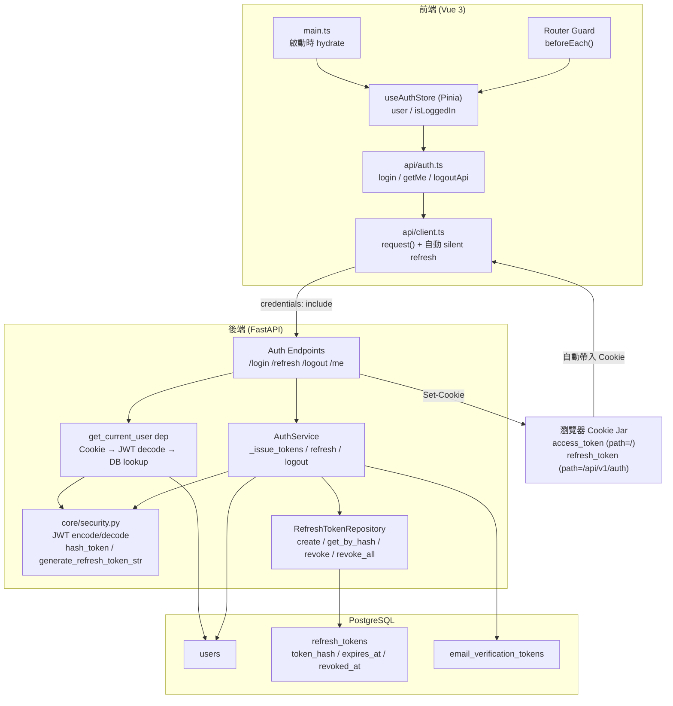

---

## Token 設計

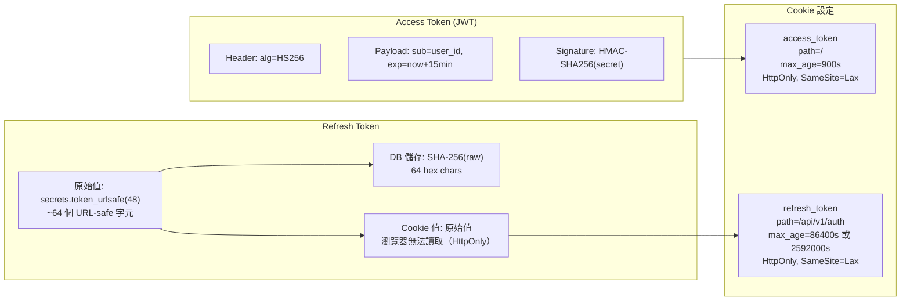

**重要設計：** Refresh Token Cookie 的 `path=/api/v1/auth` 確保瀏覽器只在呼叫 `/api/v1/auth/*` 端點時才帶入，降低 Token 洩漏範圍。

---

## 資料庫結構

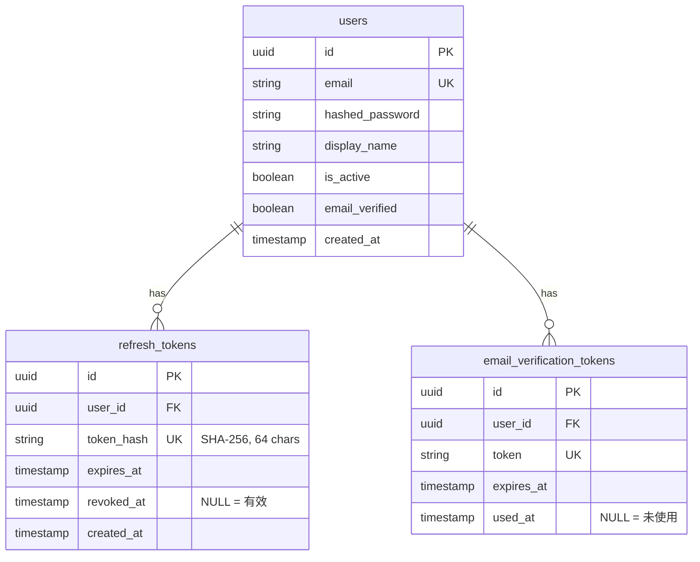

---

## 完整流程圖

### 應用程式啟動與 Hydration

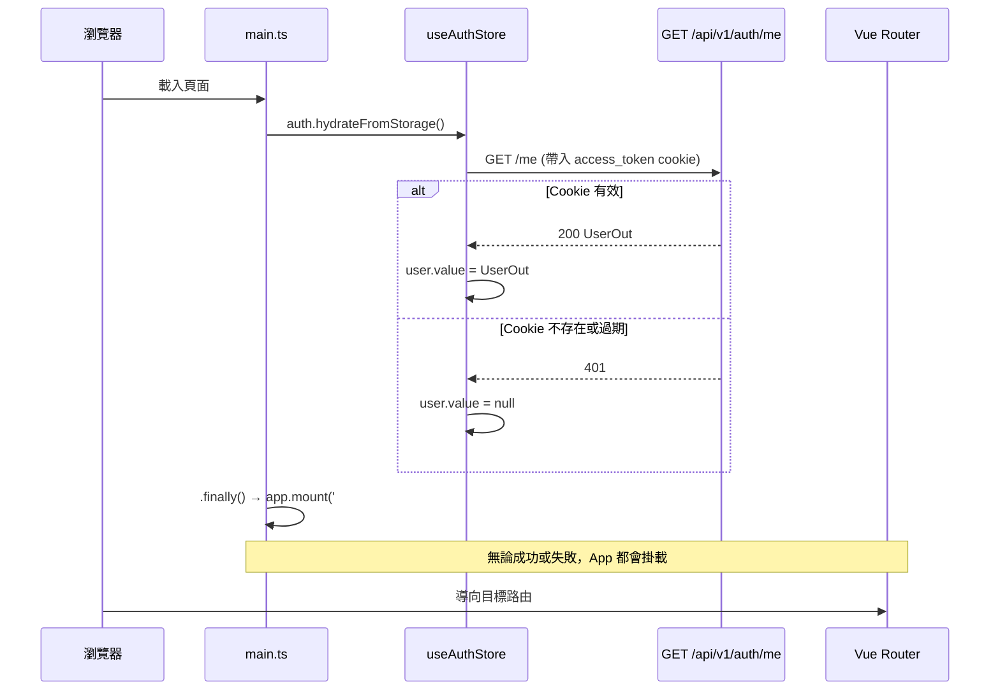

> `finally()` 確保即使 `getMe()` 失敗（使用者未登入），App 也一定掛載，不會白屏。

---

### 註冊與 Email 驗證

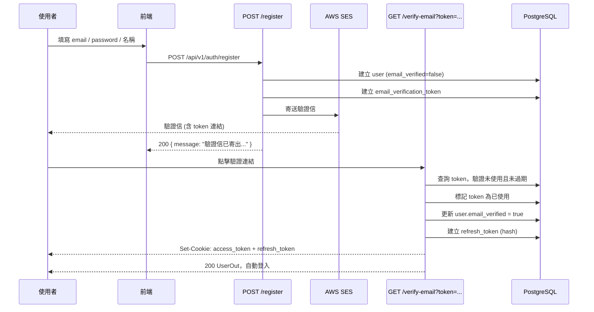

---

### 登入

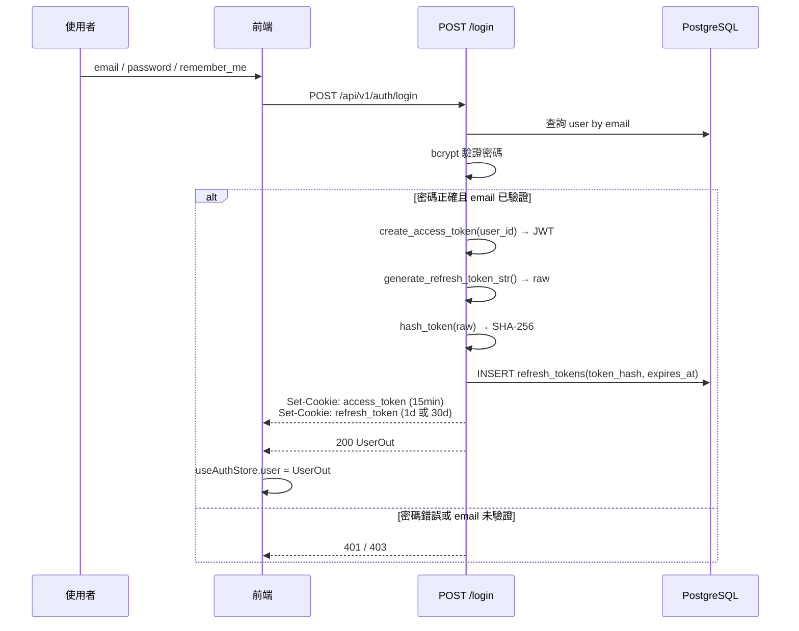

---

### 已認證的 API 請求

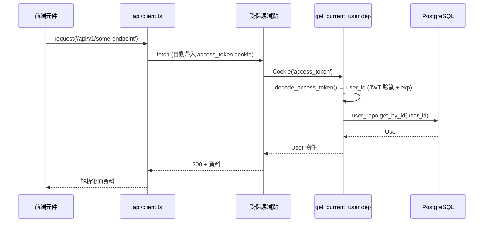

---

### 無聲刷新（Silent Refresh）

當 Access Token 過期，前端自動刷新，使用者無感。

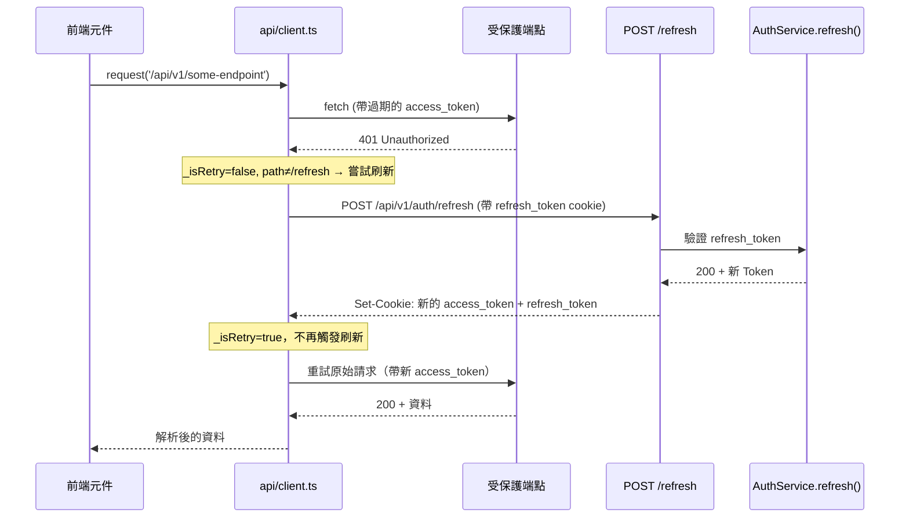

---

### Refresh Token 輪換

每次使用 Refresh Token 都會廢止舊 Token、發行新 Token。

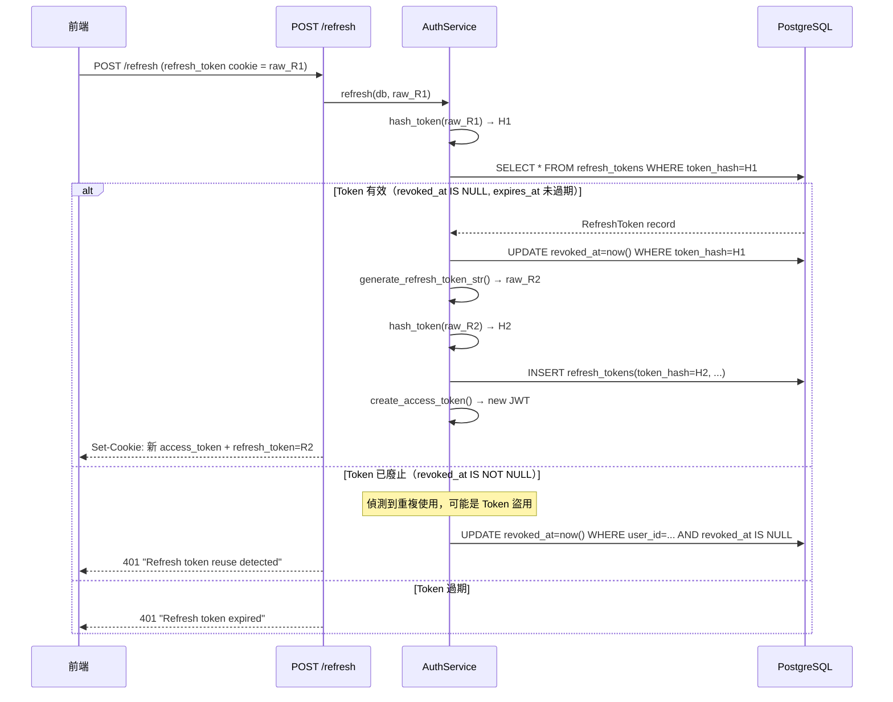

---

### Token 盜用偵測

若攻擊者取得並先使用了 Refresh Token，合法使用者的重試會觸發盜用偵測。

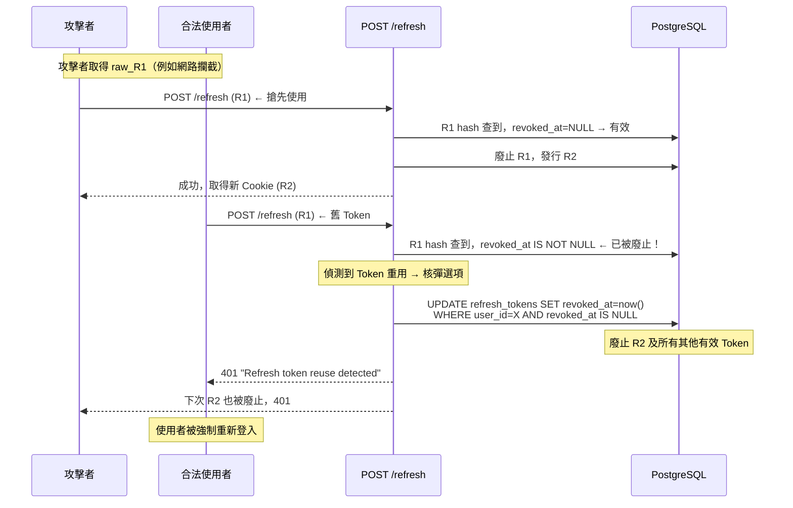

---

### 登出

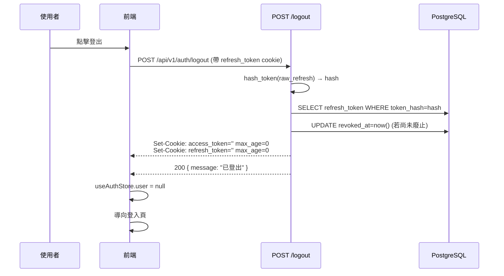

---

### 路由守衛

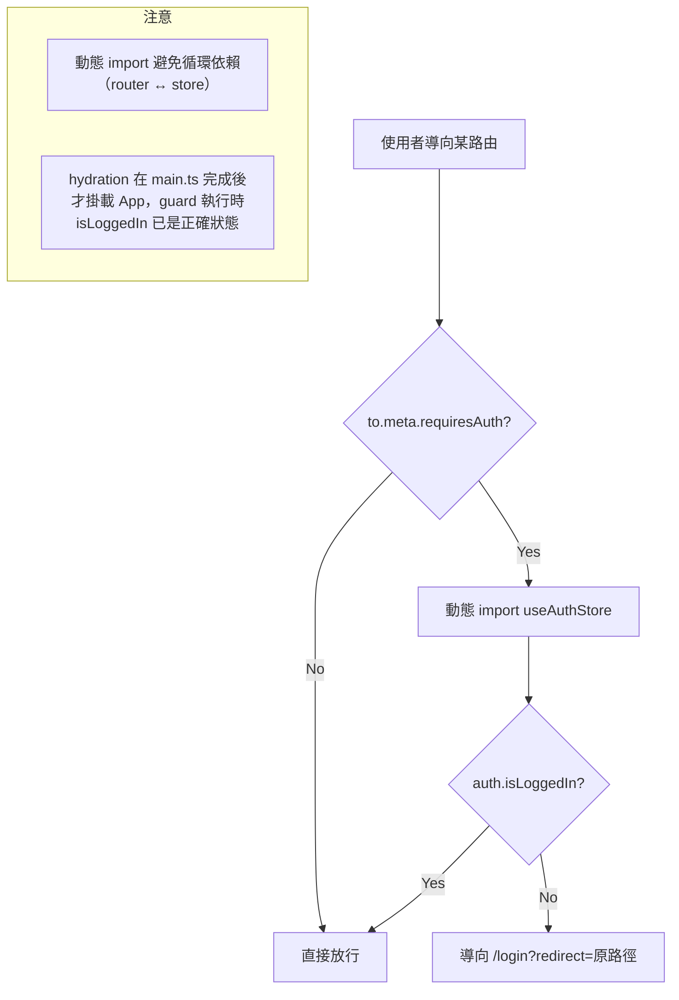

**需要登入的路由（`meta: { requiresAuth: true }`）：**

| 路由 | 路徑 |
|------|------|
| 首頁 | `/` |
| 課程詳情 | `/course/:id` |
| 我的評論 | `/my-reviews` |
| 我的等級 | `/my-level` |

---

## 安全設計決策

### HttpOnly Cookie vs localStorage

| | HttpOnly Cookie | localStorage |
|---|---|---|
| XSS 竊取 | **不可能**（JS 無法讀取） | 可直接讀取 |
| CSRF | 需 SameSite 設定 | 無 CSRF 風險 |
| 跨分頁同步 | 自動 | 需手動同步 |

### SameSite=Lax

跨站的 POST/PUT/DELETE 請求不會自動帶入 Cookie，防止 CSRF 攻擊。GET 請求（點擊連結導航）允許帶入，不影響 email 驗證連結的使用。

### Refresh Token 的 Cookie Path 限制

```
access_token   → path=/               所有 API 請求都能用
refresh_token  → path=/api/v1/auth    只有 /api/v1/auth/* 才帶入
```

Refresh Token 不會在普通 API 請求中洩漏，只在真正需要刷新時才被傳輸。

### 無聲刷新（Silent Refresh）的防無限迴圈設計

```typescript
// _isRetry=true 表示已重試過，不再觸發刷新
// path !== '/api/v1/auth/refresh' 防止刷新請求本身失敗時無窮遞迴
if (response.status === 401 && !_isRetry && path !== '/api/v1/auth/refresh') {
    // 嘗試刷新...
    return request<T>(path, options, true)  // _isRetry=true
}
```

### DB 儲存 Hash 而非原始 Token

資料庫只儲存 SHA-256(raw_token)。即使 DB 被盜，攻擊者也無法直接使用 hash 登入（hash 無法反推原始 Token）。

---

## 設定參數

| 環境變數 | 預設值 | 說明 |
|---------|--------|------|
| `JWT_SECRET_KEY` | (必填) | JWT 簽名密鑰 |
| `ACCESS_TOKEN_EXPIRE_MINUTES` | `15` | Access Token 有效期（分鐘） |
| `REFRESH_TOKEN_EXPIRE_DAYS` | `1` | Refresh Token 有效期（天） |
| `REFRESH_TOKEN_REMEMBER_ME_EXPIRE_DAYS` | `30` | 記住我模式有效期（天） |
| `COOKIE_SECURE` | `true` | 生產環境應為 `true`（HTTPS only）；本機開發設為 `false` |
| `COOKIE_SAMESITE` | `lax` | Cookie SameSite 屬性 |

**本機開發 `.env` 建議設定：**

```env
COOKIE_SECURE=false
COOKIE_SAMESITE=lax
```
